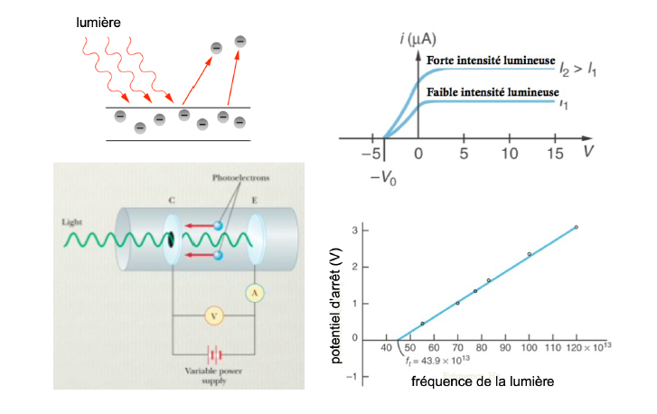
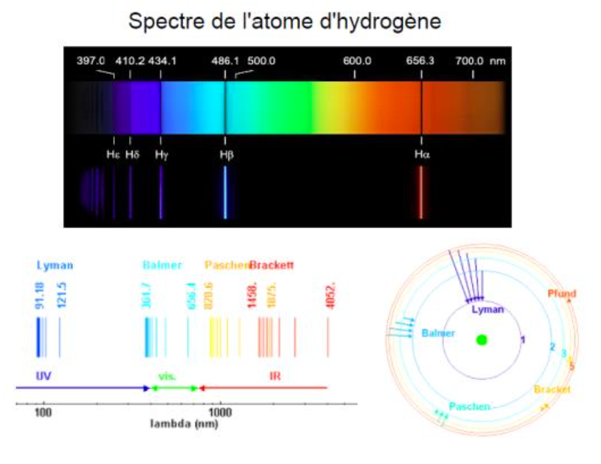

# chp1

## Part I: DÉCOUVERTE DES PHÉNOMÈNES QUANTIQUES

La MQ est née de l'impossibilité des théories classiques (mécanique, électromagnétisme, thermodynamique) d'expliquer de nombreux phénomènes observés à partir de la fin du XIX ᵉ siècle, dès lors que les progrès technologiques et la précision des mesures ont permis d'étudier en détail le comportement de la matière et du rayonnement.

### **I) État des connaissances antérieures :**

#### **1.1) Théories classiques :**

* **Mécanique** :

  * Newton 1687 : lumière = particule  
    matière, masse, forces, accélération

    * \( $m \frac{d^2r}{dt^2} = \sum \vec{F}$ \)
  * Lagrange - Laplace - Hamilton : mécanique analytique

    * Principe variationnel, action, impulsion
    * → cadre conceptuel de la MQ.
* **Électromagn.**  :

  * Maxwell 1867 : unification électricité et magnétisme

    * prédiction des ondes électr. = lumière
    * → interférences et diffraction (Young, Michelson, etc.)
* **Thermo** :

  * Boltzmann 1877 : grand nb de particules, statistiques, température, entropie \( $S = k_B \ln \Omega$ \)  
    → proba N-B \($\mathcal{P}(E) = e^{-E/k_BT}$ \)

---

#### 1.2) Structure de la matiere:

##### 1.2.1)Mise en evidence de l'electron

* Experiment de Thomson(J.J.) 1897

  * ​​

* Force de Lorentz: $\vec{F}=q(\vec{E}+\vec{v} \times \vec{B})=m \frac{d \vec{v}}{d t}$

  * rapport $\frac{q}{m} = cst$
  * la charge est transportee par une partivule massive --electron
* Experience de Millikan(1910)

  * $\vec{V}$ limite d'une goutte d'huile ionisee sous champ electrique
  * valeur de $e=-1,6 \times 10^{-19} C$

‍

##### 1.2.2 Structure atomique de la matiere

* Movment Brownien: Einstein 1905

  * $\left\langle R^2(t)\right\rangle=2 d D t$, où $d=$ dimension du système
  * $D=\frac{k_B T}{6 \pi \eta r}$, constante de Diffusion
  * Avec $r=\left(\frac{3 V}{4 \pi N_A}\right)^{1 / 3} \Rightarrow N_A=6,02 \times 10^{23}$, Perrin 1908

‍

##### 1.2.3 Structure interne des atomes :

* Becquerel 1896 : radioactivité
* Rutherford 1911 : rétrodiffusion de particules $\alpha$ $\Rightarrow$ noyau localisé et concentrant toute la masse

Structure interne des atomes :

​​

‍

## Part II

‍

### **II.1) Rayonnement du corps noir**

Lorsqu’on chauffe un objet, il émet un rayonnement d'autant plus blanc et intense que sa température est grande. Ce rayonnement est appelé rayonnement de corps noir et ne trouve aucune explication dans le cadre classique.

‍

###### **Définition**

 **(Kirchhoff)**  :

corps noir \= qui absorbe totalement toutes les $\lambda$.

‍

**Système étudié**

boîte fermée à $T$, petite ouverture pour mesurer le rayonnement interne dans la boîte.

‍

​​

‍

u(ν) est la densité spectrale volumique d'énergie du rayonnement : la quantité d'énergie rayonnée par unité de volume pour du rayonnement dans l'intervalle de fréquences $[ \nu, \nu + d\nu [$ est $u(\nu) d\nu$.

‍

‍

​​

Spectre:

1. independant du materieu
2. f(t) uniquement

‍

###### Premières approches du problem :

* Loi de Wien (semi-empirique) 1896. À haute fréquence

$$
u(\nu)=\alpha \nu^3 e^{-B \nu / T}
$$

* Loi de Rayleigh (1900). Comportement basse fréquence,

  * densité de modes dans la cavité

    $$
    \begin{gathered}
    N=2 \times \frac{1}{\rho} \times \frac{4}{3} \pi k^3=2 \times \frac{1}{\rho} \times \frac{4}{3}\left(\frac{2 \pi \nu}{c}\right)^3 \\
    k_i=n_i \frac{\pi}{L_i}=\frac{2 \pi \nu}{c} \\
    u(\nu, T)=\frac{d N}{d \nu} \times k_B T=\frac{8 \pi \nu^2}{c^3} k_B T
    \end{gathered}
    $$

$$

$$

$k_B T$ : énergie moyenne d'un mode

‍

​​

> p.s.
>
> On a meme subject dans physique statistique cette annee. vers le fin du TD

* Planck (1900) : échanges discrets d'énergie entre matière et rayonnement vibrations atomiques ----rayonnement EM

  $$
  E_{\text {éch }}=h \nu
  $$

  ​​

  $h$ : "hilfskonstant"

  $$
  h=6,62 \times 10^{-34} \mathrm{~J} \cdot \mathrm{~s}
  $$

  Énergie moyenne échangée à la fréquence $v$ :

  $$
  \langle E\rangle=\frac{\sum_{n=0}^{\infty} n h \nu e^{-n h \nu / k_B T}}{\sum_{n=0}^{\infty} e^{-n h \nu / k_B T}}=\frac{h \nu}{e^{h \nu / k B T} -1}
  $$

  et

  $$
  u(\nu)=\frac{8 \pi \nu^2}{c^3}\langle E\rangle=\frac{8 \pi \nu^2 h \nu}{c^3} \frac{1}{e^{h \nu / k_B T}-1}
  $$

  ‍

  Ici on peux utilise le notation $\beta = \frac{1}{k_B T}$, et comme ca on a l'equation suivant:

  $$
  \langle E\rangle=\frac{h \nu}{e^{-\beta h \nu} -1}
  $$

  Accord quasi-parfait avec la courbe expérimentale.

‍

‍

‍

### II.2) Effet photoélectrique:

‍

* Hertz 1887: $I_c \propto I_{\text {lumière, }}$, mais $V$ d'arrêt $\not\propto I \nu$
* Einstein 1905: Iumière = quanta d'énergie $=$ photons

Les $e^{-}$ obéissent à la loi $E_c=\frac{1}{2} m v^2=h \nu-W_{\text {seuil }}$

$$
E_{\text {lumière }}=h \nu
$$

​​

‍

‍

‍

### II.3) Effet Compton:

‍

* Compton (1923) : diffusion inélastique des rayons $X$ sur une feuille métallique

$$
h \nu^{\prime}=\frac{h \nu}{1+\frac{h \nu}{m_e c^2}(1-\cos \theta)}
$$

‍

​

‍

Explication :

Collision entre particules. Traitement relativiste de la conservation de l'E et de la quantité de mouvement :

$$
E_c=\sqrt{p_e^2 c^2+m_e^2 c^4}
$$

et

$$
\begin{gathered}
E_\gamma=h \nu \quad p_\gamma=\frac{h \nu}{c} \\
E_\gamma=p_\gamma c
\end{gathered}
$$

* Cotton et Lewis 1926 : "photon"

‍

### II.4) Dualité onde-corpuscule :

‍

Le rayonnement EM présente deux comportements distincts suivant les cas:

* particule lors de l'interaction avec la matière : collision, émission, absorption
* onde pour la propagation dans l'espace : interférences et diffraction

‍

‍

‍

​​

‍

‍

Expériences d'Aspect (1986) : interférence de photons uniques

‍

​​

ref:

https://fr.wikipedia.org/wiki/Exp%C3%A9rience_d%27Aspect

‍

‍

## Part III Quantification de l'Energie dans les atoms

‍

‍

### III.1)Spectre de raies

‍

* Balmer 1885:  Spectre des raies visible de l'atome H
* Rydberg 1900: Formule empirique pour raies de Balmer

  * $\nu_n=R y\left(\frac{1}{4}-\frac{1}{n^2}\right) \quad$ ou $\quad R y=$ cte de Rydberg

* Ritz (1908) : formule empirique pour toutes les séries

$$
\nu_{m, n}=R y\left(\frac{1}{m^2}-\frac{1}{n^2}\right)
$$

‍

​​

‍

### **III.2)Model de Bohr**

‍

* Rutherford : noyau $Z$ et $e^{-}$
* Description *classique* : potentiel central, problem de Kepler $\rightarrow$ orbites elliptiques

$$
E_m=E_c+E_p=\frac{1}{2} m v^2-\frac{Z e^2}{4 \pi \varepsilon_0 r}<0
$$

​​

‍

Description EM (Équation de Maxwell)

* $e^{-}$ accélérant circulairement $\rightarrow$ rayonnement EM de fréquence $f$ (selon l'angle orbital)
* $\vec{P}(t)=\vec{P}_0 \cos (\omega t)$ (moment dipolaire électrique)

​​

‍

‍

‍

‍

### III.3)Model de Bohr

‍

* 1913 : fréquences discrètes $\leftrightarrows$ échange d'énergie discret entre niveaux d'énergie discrets de l'atome

$$
\begin{gathered}
\Delta E_{m, n}=h \nu_{m, n}=h R_y\left(\frac{1}{m^2}-\frac{1}{n^2}\right)=E_n-E_m \\

\end{gathered}
$$

​​

‍

$$
E_n=-h R_y \frac{1}{n^2}
$$

‍

* **Franck et Hertz 1914** : perte d'énergie d'un faisceau d'$e^-$

‍

​​

‍

* Energie cinetique:

  $$
  E_c=\frac{1}{2} m v^2=q V
  $$

* Un $e^{-}$peut perdre de l'énergie dans une collision si $q V>\Delta E_{m, n}$

  * $\rightarrow e^{-}$bloqués par tension de freinage
  * $\rightarrow$ baisse du courant

‍

Conclusion: Confirmation des etats d'E quantifies dans l'atome

‍

‍

### III.4)Principe de corrependance de Bohr

‍

*La théorie classique est correcte aux grands nombres quantiques.*

‍

Exemple : atome  $\Delta E \sim \frac{1}{n^2} \rightarrow 0$ quand $n \gg 1$

Pour les mouvements périodiques, on suppose que $\nu$ lumière $=f$ orbital $e^{-}$

$$
\begin{gathered}
f_e=\frac{1}{T_e} \\
\nu=f_e \Rightarrow E_{n+1}-E_n=\frac{h}{T_e} \approx \frac{d E}{d n} \quad \text { pour } n \gg 1
\end{gathered}
$$

‍

$$
\Rightarrow \frac{d E}{d n}=\frac{h}{T(E)}
$$

‍

* Postulat de quantification de Bohr:

$$
\begin{aligned}

&\int_{E_{\min }}^{E_m} T\left(E^{\prime}\right) d E^{\prime}=n h, \quad \forall n \in \mathbb{N}^*
\end{aligned}
$$

‍

‍

‍

* Example Aton H

  $$
  E=\frac{p^2}{2 m_e}-\frac{e^2}{4 \pi \varepsilon_0 r}
  $$
* $$
  \Rightarrow T(E)=\pi e \sqrt{\frac{m_e}{2}}|E|^{-3 / 2} \quad \text { (Kepler) }
  $$

* $$
  \Rightarrow \int_{-\infty}^{E_m} T\left(E^{\prime}\right) d E^{\prime}=2 \pi e^2 \sqrt{\frac{m_e}{2}}\left|E_m\right|^{-1 / 2}=n h
  $$

* $$
  \Rightarrow E_n=-\frac{2 \pi^2 m_e e^4}{h^2} \frac{1}{n^2}=-h R_y \frac{1}{n^2}
  $$

‍

 et  $- h R_y = 13.6 eV$

‍

##### Example: Puits de potentiel $\infin$

(p.s. voir TD)

[The Infinite Potential Well](https://phys.libretexts.org/Courses/University_of_California_Davis/UCD%3A_Physics_7C_-_General_Physics/9%3A_Quantum_Mechanics/9.4%3A_The_Infinite_Potential_Well)

$$
\begin{aligned}
& E=\frac{1}{2} m v^2 \\
& T(E)=\frac{2 L}{v(E)}=\frac{2 L}{\sqrt{\frac{2 E}{m}}} \\
& \int_0^{E_n} \frac{2 L}{\sqrt{\frac{2 E}{m}}} d E=n \hbar \Rightarrow 2 \sqrt{2 m} L E^{1 / 2}=n \hbar \\
& \Rightarrow E_n=\frac{L^2}{8 m L^2} n^2  \  \sim n \geq 1
\end{aligned}
$$

‍

‍

##### Example: Puits de potentiel harmonique

​​

$$
\begin{aligned}
& E_p=\frac{1}{2} k x^2 \\
& E_m=\frac{1}{2} m \omega^2 \\
& x(t)=x_0 \cos (\omega t) \text { où } \omega=\sqrt{\frac{k}{m}}=c t e=\frac{2 \pi}{T} \\
& \int_0^{E_n} T d E=T E_n=n \hbar \Rightarrow E_n=n \hbar \omega=n \hbar \omega
\end{aligned}
$$

‍

! Atttention au terme $\frac{\hbar \omega}{2}$! $E_n=\hbar \omega\left(n+\frac{1}{2}\right)$

‍

‍

### III.5) Regle de quantification de Bohr-Sommerfield

‍

###### Rappele de meca analytique

‍

* Lagrangien : $\mathcal{L}(q, \dot{q})=E_{\text {cin }}-E_{\text {pot }}=T-V$
* Dynamique:

$$
\frac{d}{d t}\left(\frac{\partial \mathcal{L}}{\partial \dot{q}}\right)=\frac{\partial \mathcal{L}}{\partial q}
$$

* Hamiltonien :

$$
\begin{aligned}
& H(p, q)=T+V \\
& H=\sum_i \dot{q}_i \frac{\partial \mathcal{L}}{\partial \dot{q}_i}-\mathcal{L} \\
& p=\frac{\partial \mathcal{L}}{\partial \dot{q}} \text { et le moment conjugué de la variable } q
\end{aligned}
$$

* Dynamique :

$$
\frac{d q}{d t}=\frac{\partial H}{\partial p} \quad \text { et } \quad \frac{d p}{d t}=-\frac{\partial H}{\partial q}
$$

‍

###### Variables d'action

$$
S = \int_{t_1}^{t_2} \mathcal{L} dt
$$

**Principe de moindre action :**

*pour la trajectoire réelle,*  $\delta S = 0$

‍

Pour un système conservatif et un mouvement périodique, on peut montrer qu'il existe des quantités

$$
I=\frac{1}{2 \pi} \oint p d q
$$

appelées variables d'action, qui sont des extes de mot.

‍

###### Regle de Bohr-Sommerfeld

$$
I=n h \quad \text { ou } \quad \oint p d q=n h \quad n \in \mathbb{N}
$$

> p.s.
>
> $$
> \oint
> $$
>
> [Integrale de chemin](https://fr.wikipedia.org/wiki/Int%C3%A9grale_de_chemin), voir wikipedia

‍

###### Application a l'atome H:

​​

$$
\begin{aligned}
& H\left(r, \theta, \varphi, p_r, p_\theta, p_{\varphi}\right) \\
& \vec{L}=\vec{r} \times m \vec{v}=\vec{r} \times \vec{p} \\
& p_i=\frac{\partial \mathcal{L}}{\partial \bar{q}_i}
\end{aligned}
$$

##### Bohr-Sommerfeld

‍

$$
\left\{\begin{array}{l}
I_r=\frac{1}{2 \pi} \oint p_r d r=n_r \hbar \\
I_\theta=\frac{1}{2 \pi} \oint p_\theta d \theta=n_\theta \hbar \\
I_{\varphi}=\frac{1}{2 \pi} \oint p_{\varphi} d \varphi=n_{\varphi} \hbar
\end{array}\right.
$$

donc:

$$
\left\{\begin{array}{l}
\begin{aligned}
E & =-\frac{m e^4}{2\left(n_r+n_\theta+n_{\varphi}\right)^2 \hbar^2}=-\frac{m e^4}{2\left(n^2 \hbar^2\right)} \\
L & =I_\theta+I_{\varphi}=\hbar\left(n_\theta+n_{\varphi}\right) \\
L_z & =I_{\varphi}=\hbar n_{\varphi}
\end{aligned}
\end{array}\right.
$$

‍

On note:

$$
\left\{\begin{array}{rlr}
n_r+n_\theta+n_{\varphi} & =n \quad(\text { nb quantique principal }) \\
n_\theta+n_{\varphi} & =l \quad(\text { nb quantique orbital }) \\
n_{\varphi} & =m \quad(\text { nb quantique azimutal })
\end{array}\right.
$$

‍

resultat

$$
\left\{\begin{array}{rlr}
\begin{aligned}
E & =-\frac{m e^4}{2 h^2 n^2} \\
L & =l \hbar \\
L_z & =m \hbar
\end{aligned}
\end{array}\right.
$$

avec conditions suivants:

$$
\left\{\begin{array}{r}
0 \leq l \leq n-1 \\
|m| \leq l
\end{array}\right.
$$

!**Attention**

dans theorie Bohr-Sommerfeld, le definition de moment cinetique *ne peut pas* ecite comme

$$
L=\sqrt{l(l+1)} \hbar
$$

d'ou

* $l$ nombre quantique orbital
* $\hbar$ cst plank
* avec les conditions suivants:

  $$
  \left\{\begin{array}{r}
  0 \leq l \leq n-1 \\
  |m| \leq l
  \end{array}\right.
  $$

‍

La formule de moment cinetique ci-dessus n'est applicable qu'au cadre de la mécanique quantique plus *moderne*.

Dans le cadre du modèle de Bohr-Sommerfeld (un système théorique plus *ancien*), l'expression du moment angulaire est donnée par :

$$
L = l \hbar
$$

et ici, on a

$$
0 \leq l \leq n-1
$$

+effet relativists $E(n, l)$ pour structure fine.

‍

‍

## Part IV Quantification de la projectiong du moment cinetique sous champ $\vec{B}$

‍

### IV.1) Spectre atomique sans champ $\vec{B}$

Effet Zeeman

* normal $(2l+1)$ raies car $-l \leq m \leq l$
* anormal 2s raies incompatible Bohr-Sommerfeld

‍

​​

‍

### IV.2) Effet Zeeman normal

‍

orbit $e^{-}$ = spire de courant

​​

###### Moment magnétique:

$$
\begin{gathered}
\vec{\mu}=I S \\
\mu=\frac{-|e|}{2 m_e} L \\
L=g \vec{L}
\end{gathered}
$$

g rapport gyromag. (*cf. EP3*)

‍

‍

​​

‍

$$
\begin{gathered}
E=-\vec{\mu} \cdot \vec{B} \\
\vec{F}=(\vec{\mu} \cdot \nabla) \vec{B} \\
\vec{\Gamma}=\vec{\mu} \wedge \vec{B}
\end{gathered}
$$

‍

###### Hamiltonian

$$
H=H_0-\vec{\mu} \cdot \vec{B}=H_0+\frac{|e| B}{2 m_e} L_z
$$

###### Bohr-sommerfeld

$$
I_{\varphi}=L_z=m \hbar
$$

‍

$$
\begin{gathered}
\Rightarrow E(n, l, m)=E_0(n, l)+m \frac{|e| \hbar}{2 m_e} B \\
=E_0(n, l)+m \mu_B B
\end{gathered}
$$

‍

###### Magneton de Bohr

$$
\mu_B=\frac{|e| \hbar}{2 m_e}
$$

​​

‍

‍

### IV.3) Effet Zeeman anormal: expérience de Stern et Gerlach

$$
\vec{F}=(\vec{\mu} \cdot \nabla) \vec{B}
$$

* On trie les atomes par valeur et direction de $\vec{\mu}$.
* Atomes d'Ag $\rightarrow 2$ taches $\rightarrow$ incompatible $(2 l+1)$ Bohr-Sommerfeld

​​

> ref: Feymann lecture volumn III, chp5:Spin 1
>
> https://www.feynmanlectures.caltech.edu/III_05.html#Ch5-S1

‍

### IV.4) Introduction du spine

**Principe d'exclusion de Pauli (1924)**

* 2 éléments consécutifs de $\hat{m}$ $n, l, m$ → pas les $\hat{m}$ propriétés (ex H et He)  
  → introduction de $m_s \in \mathbb{N}$ avec 2 valeurs pour distinguer leur état Q.

---

**Uhlenbeck &amp; Goudsmit (1925)**

* *Moment cinétique* intrinsèque $\vec{S}$ tel que

  $$
  S_z = m_s \hbar \quad \text{où} \quad m_s = \pm \frac{1}{2}
  $$

---

**Pour reproduire l’amplitude exp du shift Zeeman, on doit écrire**

$$
\vec{\mu^s} = - g_0 \frac{|e|}{2 m_e} \vec{S}
$$

où $g_0$ \= facteur gyromag de l’é$^-$

---

**$g_0 = 2,0023$**​ **: Feynman**

‍

 **- Équation de Dirac (1928) :**

→ MQ relativiste

→ 3 état \= spineur à 4 composantes

* 2 matrices ($+E$) / antimatrice ($-E$)
* 2 spineur couplés

$H = H_0 + \frac{|e|}{m_e} \vec{S} \cdot \vec{B}$​**$S^+$**

**est un opérateur vectoriel défini dans un espace de dim. 4 ayant 3 composantes dans l'espace réel.**
